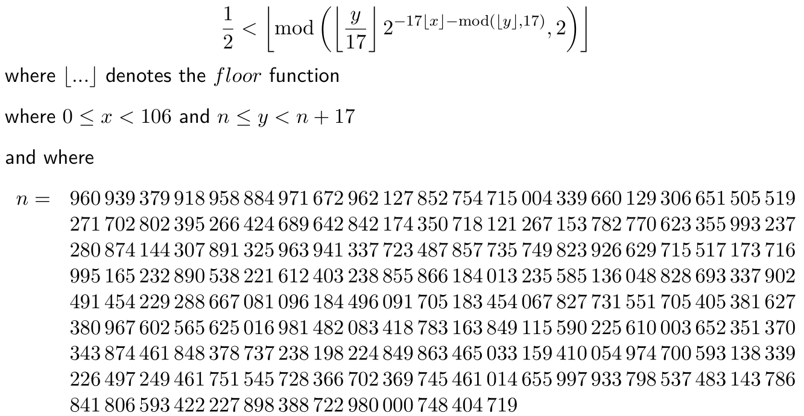
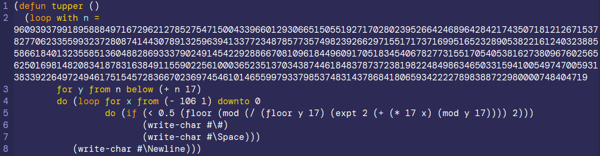
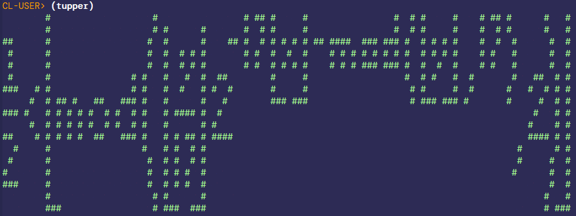

# cl-problem-solving

Hobby project using Common Lisp to solve numeric puzzles as those proposed by Project Euler. 

When relevant, an optimized solution, compiling with no note under `(speed 3)` is proposed.

A test suite is proposed.

Table of contents:
- [Project Euler](#project-euler)
- [Other puzzles](#other-puzzles)
- [Tupper formula](#tupper-formula)

Any comment? Open an [issue](https://github.com/occisn/cl-problem-solving/issues), or start a discussion [here](https://github.com/occisn/cl-problem-solving/discussions) or [at profile level](https://github.com/occisn/occisn/discussions).

# Project Euler

Project Euler problems solved are: [1](https://projecteuler.net/problem=1), [2](https://projecteuler.net/problem=2), [3](https://projecteuler.net/problem=3), [4](https://projecteuler.net/problem=4), [5](https://projecteuler.net/problem=5), [6](https://projecteuler.net/problem=6), [7](https://projecteuler.net/problem=7), [8](https://projecteuler.net/problem=8), [9](https://projecteuler.net/problem=9), [10](https://projecteuler.net/problem=10), [11](https://projecteuler.net/problem=11), [12](https://projecteuler.net/problem=12), [13](https://projecteuler.net/problem=13), [14](https://projecteuler.net/problem=14), [15](https://projecteuler.net/problem=15), [16](https://projecteuler.net/problem=16), [17](https://projecteuler.net/problem=17), [18](https://projecteuler.net/problem=18), [19](https://projecteuler.net/problem=19), [20](https://projecteuler.net/problem=20), [21](https://projecteuler.net/problem=21), [22](https://projecteuler.net/problem=22), [23](https://projecteuler.net/problem=23), [24](https://projecteuler.net/problem=24), [25](https://projecteuler.net/problem=25), [26](https://projecteuler.net/problem=26), [27](https://projecteuler.net/problem=27), [28](https://projecteuler.net/problem=28), [29](https://projecteuler.net/problem=29), [30](https://projecteuler.net/problem=30), [31](https://projecteuler.net/problem=31), [32](https://projecteuler.net/problem=32), [33](https://projecteuler.net/problem=33), [34](https://projecteuler.net/problem=34), [35](https://projecteuler.net/problem=35), [36](https://projecteuler.net/problem=36), [37](https://projecteuler.net/problem=37), [38](https://projecteuler.net/problem=38), [39](https://projecteuler.net/problem=39), [40](https://projecteuler.net/problem=40), [41](https://projecteuler.net/problem=41), [42](https://projecteuler.net/problem=42), [43](https://projecteuler.net/problem=43), [44](https://projecteuler.net/problem=44), [45](https://projecteuler.net/problem=45), [46](https://projecteuler.net/problem=46), [47](https://projecteuler.net/problem=47), [48](https://projecteuler.net/problem=48), [49](https://projecteuler.net/problem=49), [50](https://projecteuler.net/problem=50), [51](https://projecteuler.net/problem=51), [52](https://projecteuler.net/problem=52), [53](https://projecteuler.net/problem=53), [54](https://projecteuler.net/problem=54), [55](https://projecteuler.net/problem=55), [56](https://projecteuler.net/problem=56), [57](https://projecteuler.net/problem=57), [58](https://projecteuler.net/problem=58), [59](https://projecteuler.net/problem=59), [60](https://projecteuler.net/problem=60), [61](https://projecteuler.net/problem=61), [62](https://projecteuler.net/problem=62), [63](https://projecteuler.net/problem=63), [64](https://projecteuler.net/problem=64), [65](https://projecteuler.net/problem=65), [66](https://projecteuler.net/problem=66), [67](https://projecteuler.net/problem=67), [68](https://projecteuler.net/problem=68), [69](https://projecteuler.net/problem=69), [70](https://projecteuler.net/problem=70), [71](https://projecteuler.net/problem=71), [72](https://projecteuler.net/problem=72), [73](https://projecteuler.net/problem=73), [74](https://projecteuler.net/problem=74), [75](https://projecteuler.net/problem=75), [80](https://projecteuler.net/problem=80), [81](https://projecteuler.net/problem=81), [89](https://projecteuler.net/problem=89), [254](https://projecteuler.net/problem=254), [684](https://projecteuler.net/problem=684).

# Other puzzles

- **Anecdotes Maths** — Mathematical anecdotes and curiosities from [@AnecdotesMaths](https://x.com/AnecdotesMaths)
- **Certificat** — Josephus problem
- **Devil Calculator** — Devil Math Facts
- **Fermat's Library** — Number theory curiosities from [@fermatslibrary](https://x.com/fermatslibrary)
- **Ile Maths** — French number-to-words conversion

# Tupper formula

Tupper's self-referential formula is a formula that visually represents itself when graphed on plane.

See [Wikipedia](https://en.wikipedia.org/wiki/Tupper%27s_self-referential_formula) or [Wolfram MathWorld](https://mathworld.wolfram.com/TuppersSelf-ReferentialFormula.html).

Formula:

SBCL supports 'big' integers, which allows implementing the formula directly:

Output:

I have added this code to [Rosetta Code](https://rosettacode.org/wiki/Tupper%27s_self-referential_formula).

(end of README)
